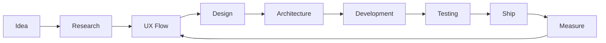

<!-- ============================= -->
<!--        SYSTEM BOOT            -->
<!-- ============================= -->

<p align="center">
  
</p>

<p align="center">
  
</p>

<p align="center">
  <a href="https://chaudharyalekh.vercel.app/">
    
  </a>
  <a href="https://www.linkedin.com/in/alekh-chaudhary/">
    
  </a>
</p>

<br/>

```bash
alekh@github:~$ whoami
```

## `> ABOUT_ME`

```yaml
name: Alekh Chaudhary
location: Kathmandu, Nepal

role:
  - Mobile App Developer
  - UI/UX Designer
  - Software Engineer

focus:
  - Mobile Engineering
  - Product Design
  - Software Architecture
  - AI-assisted Development

status: "building, learning, shipping"
```

I build **real-world digital products** with a strong focus on:

```diff
+ Clean architecture
+ Scalable applications
+ Human-centered UX
+ Performance
+ Maintainability
+ Product thinking
```

I enjoy working at the intersection of **engineering and design** — turning ideas into products that are technically solid and actually pleasant to use.

---

```bash
alekh@github:~$ cat tech_stack.json
```

## `> TECH_STACK`

<p align="center">
  
</p>

```json
{
  "mobile": [
    "Flutter",
    "Dart",
    "Kotlin",
    "Jetpack Compose"
  ],

  "frontend": [
    "React",
    "Next.js"
  ],

  "backend": [
    "Node.js",
    "NestJS"
  ],

  "database": [
    "PostgreSQL",
    "MongoDB",
    "Redis"
  ],

  "devops": [
    "Docker",
    "Nginx",
    "Git",
    "GitHub"
  ],

  "design": [
    "Figma",
    "UI/UX Design",
    "Design Systems"
  ]
}
```

---

```bash
alekh@github:~$ ./capabilities.sh
```

## `> WHAT_I_BUILD`

```text
[01] Mobile Applications
     ├── Flutter
     ├── Kotlin
     ├── REST API Integration
     ├── Authentication
     ├── Payments
     ├── Push Notifications
     └── Production Architecture

[02] Product Interfaces
     ├── UI/UX Design
     ├── Design Systems
     ├── Wireframes
     ├── Prototypes
     └── Developer-ready Figma

[03] Backend Systems
     ├── REST APIs
     ├── PostgreSQL
     ├── MongoDB
     ├── Redis
     ├── Docker
     └── Scalable Services

[04] Product Engineering
     ├── MVP Development
     ├── Architecture Planning
     ├── Product Flows
     ├── Performance Optimization
     └── Iterative Delivery
```

---

```bash
alekh@github:~$ ls ./projects
```

## `> FEATURED_PROJECTS`

### `01. DOKOMANDU`

```bash
$ category     food-tech / commerce
$ architecture clean + scalable mobile architecture
$ platform     mobile ecosystem
$ status       building
```

Building a scalable commerce ecosystem covering:

- Customer application
- Merchant application
- Delivery workflow
- Kitchen discovery
- Cart & checkout
- Order tracking
- Payments
- Ratings & reviews

`Flutter` `Riverpod` `Dio` `GoRouter` `Firebase`

---

### `02. RESTAURANT POS`

```bash
$ category     SaaS / Restaurant Technology
$ architecture client + api + database
$ status       active-development
```

Restaurant operations platform designed around:

- POS
- Orders
- Inventory
- Kitchen workflow
- Roles & permissions
- Sales analytics
- Receipt printing

`React` `Node.js` `PostgreSQL` `Docker` `Nginx`

---

### `03. BUSINESS SYSTEMS`

```text
> HRM
> Candidate Tracking
> Grievance Management
> Payroll
> Billing
> Internal Operations
```

I also work on practical business systems where usability, workflow clarity and maintainable architecture matter more than flashy features.

---

```bash
alekh@github:~$ ./engineering_principles
```

## `> ENGINEERING_MINDSET`

```txt
01 // Users > unnecessary complexity

02 // Architecture should solve problems,
      not create new ones.

03 // Good UX is part of engineering.

04 // Ship early.
      Measure.
      Improve.

05 // Clean code matters,
      but useful products matter more.

06 // Build for today.
      Architect for tomorrow.
```

---

```bash
alekh@github:~$ git status
```

## `> CURRENT_FOCUS`

```diff
+ Deepening Kotlin & Jetpack Compose
+ Building production-grade Flutter applications
+ Exploring AI-assisted software engineering
+ Improving scalable backend architecture
+ Learning data-driven product development
+ Expanding product design systems
```

---

```bash
alekh@github:~$ cat workflow.txt
```

## `> HOW_I_WORK`



---

```bash
alekh@github:~$ github --stats
```

## `> GITHUB_ACTIVITY`

<p align="center">
  
</p>

<p align="center">
  
</p>

<p align="center">
  
</p>

---

```bash
alekh@github:~$ ./connect.sh
```

## `> CONNECT`

<p align="center">

<a href="https://chaudharyalekh.vercel.app/">
  
</a>

<a href="https://www.linkedin.com/in/alekh-chaudhary/">
  
</a>

<a href="mailto:chaudharyalekh@gmail.com">
  
</a>

</p>

<br/>

```console
alekh@github:~$ echo "Build things people actually use."

Build things people actually use.

alekh@github:~$ _
```

<p align="center">
  
</p>
