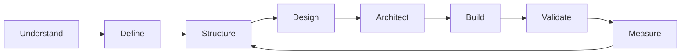

<!-- ===================================================== -->
<!--                ALEKH CHAUDHARY                        -->
<!--        SOFTWARE ENGINEERING × PRODUCT DESIGN          -->
<!-- ===================================================== -->

<p align="center">
  
</p>

<p align="center">
  
</p>

<p align="center">
  <a href="https://chaudharyalekh.vercel.app/">
    
  </a>
  <a href="https://www.linkedin.com/in/alekh-chaudhary/">
    
  </a>
  <a href="mailto:chaudharyalekh@gmail.com">
    
  </a>
</p>

<br>

<table>
<tr>
<td width="58%" valign="top">

## Hello, I'm Alekh.

I work at the intersection of **software engineering, product thinking, and interface design**.

My focus is not simply writing code or making screens look good. I care about the full product system:

- how users move through it,
- how the architecture supports it,
- how teams maintain it,
- and how the product evolves after launch.

I build **mobile-first digital products** with an emphasis on clarity, scalability, usability, and long-term maintainability.

</td>

<td width="42%" valign="top">

```yaml
profile:
  discipline:
    - software engineering
    - product design

  focus:
    - mobile systems
    - UX architecture
    - scalable platforms
    - design systems

  approach:
    - understand
    - simplify
    - architect
    - build
    - measure
    - improve
```

</td>
</tr>
</table>

---

# 01 — Expertise

<table>
<tr>

<td width="33%" valign="top">

### Product Engineering

Designing software around real product needs rather than isolated technical requirements.

`Architecture`  
`MVP Development`  
`Product Flows`  
`Performance`  
`Scalability`  
`API Integration`

</td>

<td width="33%" valign="top">

### Mobile Engineering

Building maintainable mobile applications designed for production environments.

`Flutter`  
`Dart`  
`Kotlin`  
`Jetpack Compose`  
`Firebase`  
`REST APIs`

</td>

<td width="33%" valign="top">

### Product & UX Design

Designing experiences where usability and engineering feasibility work together.

`Figma`  
`UX Architecture`  
`Design Systems`  
`Prototyping`  
`User Flows`  
`Developer Handoff`

</td>

</tr>
</table>

---

# 02 — Technology

<p align="center">
  
</p>

<details>
<summary><b>View engineering stack</b></summary>

<br>

| Domain | Technologies |
|---|---|
| **Mobile** | Flutter, Dart, Kotlin, Jetpack Compose |
| **Frontend** | React, Next.js |
| **Backend** | Node.js, NestJS |
| **Data** | PostgreSQL, MongoDB, Redis |
| **Infrastructure** | Docker, Nginx, Git, GitHub |
| **Cloud / Services** | Firebase, REST APIs |
| **Design** | Figma, Design Systems, Prototyping |

</details>

---

# 03 — Selected Work

## DokoMandu

> **Food commerce ecosystem · Mobile-first platform**

<table>
<tr>
<td width="63%" valign="top">

A multi-sided product ecosystem connecting customers, merchants, and delivery operations.

### Product scope

- Kitchen discovery
- Product browsing
- Cart and checkout
- Scheduled delivery
- Payments
- Order lifecycle
- Tracking
- Merchant operations
- Ratings and reviews
- Notifications

</td>

<td width="37%" valign="top">

```yaml
platform:
  type: commerce ecosystem
  status: active

engineering:
  architecture: modular
  state: riverpod
  networking: dio
  routing: go_router

design:
  priority:
    - simplicity
    - conversion
    - discoverability
```

</td>
</tr>
</table>

<p>
  
  
  
  
</p>

---

## Restaurant POS Platform

> **Operations platform · SaaS architecture**

<table>
<tr>
<td width="63%" valign="top">

A restaurant operations platform designed around day-to-day workflows rather than disconnected features.

### Product scope

- POS
- Orders
- Kitchen workflow
- Inventory
- Staff roles
- Receipt printing
- Sales data
- Operational reporting

</td>

<td width="37%" valign="top">

```yaml
architecture:
  client: react
  backend: node
  database: postgres

deployment:
  docker: true
  nginx: true

principles:
  - fast workflows
  - clear permissions
  - operational reliability
```

</td>
</tr>
</table>

---

## Business Systems

> **Internal platforms · Workflow automation**

I also design and build internal systems where **information architecture and workflow design** are often more important than visual decoration.

```text
HRM
│
├── Employee Operations
├── Payroll
├── Attendance
└── Administration

Candidate Management
│
├── Project-Based Records
├── Dynamic Data Fields
├── Status Workflows
└── Reporting

Business Operations
│
├── Billing
├── Grievance Management
├── Internal Tracking
└── Management Dashboards
```

---

# 04 — How I Think

<table>
<tr>
<td width="50%" valign="top">

### Engineering

```text
Complexity should earn its place.

Architecture should make
future development easier,
not simply look sophisticated.

Systems should be:
• understandable
• maintainable
• observable
• scalable
```

</td>

<td width="50%" valign="top">

### Design

```text
Good UI is not decoration.

It is the visible layer of:
• information architecture
• hierarchy
• user intent
• feedback
• interaction logic

The best interfaces feel obvious.
```

</td>
</tr>
</table>

---

# 05 — Product Process



### My typical workflow

```text
01  Understand the problem
02  Define product constraints
03  Map user journeys
04  Structure information
05  Design interaction patterns
06  Choose architecture
07  Build incrementally
08  Test with real scenarios
09  Measure outcomes
10  Refine
```

---

# 06 — Design Principles

<details>
<summary><b>01. Clarity over decoration</b></summary>

<br>

Interfaces should communicate hierarchy immediately.

Users should understand:

- where they are,
- what they can do,
- what happened,
- and what happens next.

</details>

<details>
<summary><b>02. Systems over isolated screens</b></summary>

<br>

A product is not a collection of beautiful pages.

I think in reusable:

- components,
- states,
- tokens,
- patterns,
- workflows,
- and system-level behavior.

</details>

<details>
<summary><b>03. Engineering and design should agree</b></summary>

<br>

Great products happen when design understands implementation constraints and engineering understands user experience.

The handoff should not be a wall between the two.

</details>

<details>
<summary><b>04. Scale only where scale matters</b></summary>

<br>

Not every MVP needs enterprise architecture.

I prefer the simplest architecture that can support the expected product evolution without creating unnecessary technical debt.

</details>

---

# 07 — Currently Exploring

<table>
<tr>

<td align="center" width="25%">

### Kotlin

Native mobile engineering

</td>

<td align="center" width="25%">

### Compose

Modern Android UI systems

</td>

<td align="center" width="25%">

### AI

AI-assisted product engineering

</td>

<td align="center" width="25%">

### Data

Product analytics & insights

</td>

</tr>
</table>

---

# 08 — GitHub

<p align="center">
  
  
</p>

<p align="center">
  
</p>

<details>
<summary><b>View contribution graph</b></summary>

<br>

<p align="center">
  
</p>

</details>

---

# 09 — Beyond Code

```text
I enjoy solving the space between:

        DESIGN
           │
           │
PRODUCT ───┼─── ENGINEERING
           │
           │
        BUSINESS
```

That usually means asking questions such as:

> What does the user actually need?

> What is the simplest interaction?

> What architecture supports this product?

> What should be reusable?

> What should not be built yet?

> How will this behave six months from now?

---

# 10 — Contact

<p align="center">
  <b>Building something interesting?</b>
</p>

<p align="center">
  I'm always interested in thoughtful product, engineering, and design conversations.
</p>

<p align="center">
  <a href="https://chaudharyalekh.vercel.app/">
    
  </a>
  <a href="https://www.linkedin.com/in/alekh-chaudhary/">
    
  </a>
  <a href="mailto:chaudharyalekh@gmail.com">
    
  </a>
</p>

<br>

<p align="center">
  <sub>
    Design with intent. Engineer for change. Build for people.
  </sub>
</p>

<p align="center">
  
</p>
