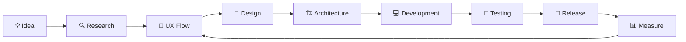

<!-- ========================= -->
<!--        HERO AREA          -->
<!-- ========================= -->

<p align="center">
  
</p>

<p align="center">
  
</p>

<p align="center">

<a href="https://chaudharyalekh.vercel.app/">
  
</a>

<a href="https://www.linkedin.com/in/alekh-chaudhary/">
  
</a>

<a href="mailto:chaudharyalekh@gmail.com">
  
</a>

</p>

<p align="center">
  
</p>

---

# 👨‍💻 About Me

```bash id="8r8lqv"
alekh@github:~$ whoami
```

```yaml id="yqr289"
name: Alekh Chaudhary
location: Kathmandu, Nepal

roles:
  - Software Engineer
  - Mobile App Developer
  - UI/UX Designer

interests:
  - Mobile Engineering
  - Software Architecture
  - Product Design
  - AI-assisted Development

current_status: Building. Learning. Shipping.
```

I enjoy building **real-world software products** that combine solid engineering with thoughtful design.

My work focuses on:

- 📱 Mobile application development
- 🧠 Product architecture
- 🎨 UI/UX design
- ⚙️ Backend systems
- 🚀 MVP development
- 📊 Data-driven product improvement

---

# ⚡ Tech Stack

<p align="center">
  
</p>

<details>
<summary><b>📱 Mobile Development</b></summary>

<br>

```text id="fcgopv"
Flutter
Dart
Kotlin
Jetpack Compose
Firebase
REST APIs
Push Notifications
Maps & Location
Payment Integration
```

</details>

<details>
<summary><b>⚙️ Backend & Database</b></summary>

<br>

```text id="9atqqv"
Node.js
NestJS
PostgreSQL
MongoDB
Redis
Prisma
REST APIs
Authentication
Docker
```

</details>

<details>
<summary><b>🎨 UI/UX & Product Design</b></summary>

<br>

```text id="zs1chp"
Figma
Wireframing
Prototyping
Design Systems
User Flows
Mobile UI
Responsive Interfaces
Developer Handoff
```

</details>

---

# 🧩 What I Build

```bash id="ykha86"
alekh@github:~$ ./capabilities
```

<table>
<tr>

<td width="50%">

### 📱 Mobile Applications

```text id="3ua1fo"
Flutter
Kotlin
Firebase
REST APIs
Payments
Notifications
Maps
Clean Architecture
```

</td>

<td width="50%">

### 🎨 Product Design

```text id="e3eah4"
UI/UX
Figma
User Flows
Design Systems
Prototypes
Responsive UI
Developer Handoff
```

</td>

</tr>

<tr>

<td width="50%">

### ⚙️ Backend Systems

```text id="x1nmgg"
Node.js
NestJS
PostgreSQL
MongoDB
Redis
Docker
Nginx
API Architecture
```

</td>

<td width="50%">

### 🚀 Product Engineering

```text id="rjx9vh"
MVP Development
Architecture
Product Strategy
Performance
Scalability
Iteration
Deployment
```

</td>

</tr>
</table>

---

# 🚀 Featured Projects

<details open>
<summary><b>🍔 DokoMandu — Food Commerce Platform</b></summary>

<br>

```yaml id="7grmec"
type: Mobile Commerce Platform
status: Active Development
architecture: Clean + Modular
```

### Features

- Customer application
- Merchant application
- Kitchen discovery
- Product browsing
- Cart & checkout
- Delivery scheduling
- Order tracking
- Payments
- Ratings & reviews
- Notifications

### Technology

<p>


</p>

</details>

---

<details>
<summary><b>🍽 Restaurant POS & Management System</b></summary>

<br>

```yaml id="jk4b84"
type: Restaurant SaaS
status: Development
platform: Web + Backend
```

### Features

- POS
- Order management
- Kitchen workflow
- Inventory
- Staff roles
- Receipt printing
- Sales analytics
- Multi-user access

### Technology

<p>


</p>

</details>

---

<details>
<summary><b>🏢 Business & Internal Systems</b></summary>

<br>

I also work on internal business tools and management platforms.

```text id="q0f7w9"
├── HRM
├── Payroll
├── Candidate Tracking
├── Billing
├── Grievance Management
├── Recruitment Systems
└── Internal Operations Tools
```

</details>

---

# 🧠 Engineering Mindset

```bash id="d3vqmv"
alekh@github:~$ cat principles.txt
```

```text id="p7ekbz"
01. Solve the user's problem first.

02. Good UX is part of good engineering.

03. Architecture should reduce complexity,
    not introduce more of it.

04. Build quickly.
    Test.
    Learn.
    Improve.

05. Clean code matters,
    but useful products matter more.

06. Design for today's requirements
    without blocking tomorrow's growth.
```

---

# 🔭 Currently Exploring

<p align="center">


</p>

---

# 📊 GitHub Analytics

<p align="center">


</p>

<p align="center">


</p>

---

# 📈 Contribution Activity

<p align="center">


</p>

---

# 🔄 My Development Process



---

# 🌐 Let's Connect

<p align="center">

<a href="https://chaudharyalekh.vercel.app/">

</a>

<br><br>

<a href="https://www.linkedin.com/in/alekh-chaudhary/">

</a>

<a href="mailto:chaudharyalekh@gmail.com">

</a>

</p>

---

<p align="center">

```text id="ppv2xc"
┌──────────────────────────────────────────────┐
│                                              │
│     Build things people actually use.       │
│                                              │
└──────────────────────────────────────────────┘
```

</p>

<p align="center">
  
</p>
